# MOFI - ERD MVP (bản để review)

> Phạm vi: tài liệu thiết kế dài hạn v0.1. Khi làm demo 2 ngày, dùng [bộ tài liệu demo 1.0](demo/README.md). Các quy tắc khác nhau như nhiều tài khoản, goal earmark, reversal và jobs không áp dụng cho demo.

v0.1 - Dự thảo. Đây là mô hình logic, chưa phải migration. Tên bảng phản ánh [DATA_DICTIONARY](DATA_DICTIONARY.md); trước migration cần một người review cả nghiệp vụ và SQL.

```mermaid
erDiagram
    USERS ||--|| PROFILES : has
    USERS ||--o{ PORTFOLIOS : owns
    USERS ||--o{ MANUAL_ASSETS : owns
    USERS ||--o{ FINANCIAL_GOALS : owns
    USERS ||--o{ WATCHLISTS : owns
    USERS ||--o{ ALERT_RULES : owns
    USERS ||--o{ TASKS : owns
    USERS ||--o{ NOTIFICATIONS : receives
    USERS ||--o{ FINANCIAL_EVENTS : creates
    USERS ||--|| USER_FINANCIAL_STATES : has
    PORTFOLIOS ||--o{ CASH_ACCOUNTS : contains
    PORTFOLIOS ||--o{ TRADE_ENTRIES : contains
    CASH_ACCOUNTS ||--o{ CASH_ENTRIES : records
    FINANCIAL_EVENTS ||--o{ CASH_ENTRIES : posts
    FINANCIAL_EVENTS ||--o| TRADE_ENTRIES : describes
    FINANCIAL_EVENTS ||--o| INCOME_ENTRIES : describes
    FINANCIAL_EVENTS ||--o| FINANCIAL_EVENTS : reverses
    MARKETS ||--o{ INSTRUMENTS : lists
    ASSET_CLASSES ||--o{ INSTRUMENTS : classifies
    SECTORS ||--o{ INSTRUMENTS : groups
    INSTRUMENTS ||--o{ TRADE_ENTRIES : traded
    INSTRUMENTS ||--o{ INCOME_ENTRIES : pays
    INSTRUMENTS ||--o{ MARKET_QUOTES : quoted
    MARKET_PROVIDERS ||--o{ MARKET_QUOTES : supplies
    MARKET_PROVIDERS ||--o{ PROVIDER_INSTRUMENTS : maps
    INSTRUMENTS ||--o{ PROVIDER_INSTRUMENTS : mapped
    PORTFOLIOS ||--o{ POSITION_PROJECTIONS : projects
    INSTRUMENTS ||--o{ POSITION_PROJECTIONS : held
    PORTFOLIOS ||--o{ PORTFOLIO_SNAPSHOTS : snapshots
    VALUATION_RUNS ||--o{ PORTFOLIO_SNAPSHOTS : publishes
    MANUAL_ASSETS ||--o{ MANUAL_VALUATIONS : valued
    FINANCIAL_GOALS ||--o{ GOAL_ALLOCATIONS : reserves
    CASH_ACCOUNTS ||--o{ GOAL_ALLOCATIONS : earmarks
    WATCHLISTS ||--o{ WATCHLIST_ITEMS : contains
    INSTRUMENTS ||--o{ WATCHLIST_ITEMS : watched
    ALERT_RULES ||--o{ ALERT_EVENTS : triggers
    ALERT_EVENTS ||--o| NOTIFICATIONS : notifies

    USERS { bigint id PK }
    PROFILES { bigint user_id FK }
    PORTFOLIOS { bigint id PK bigint user_id FK }
    CASH_ACCOUNTS { bigint id PK bigint user_id FK bigint portfolio_id FK }
    FINANCIAL_EVENTS { bigint id PK bigint user_id FK uuid idempotency_key }
    CASH_ENTRIES { bigint event_id FK bigint cash_account_id FK numeric amount }
    TRADE_ENTRIES { bigint event_id FK bigint portfolio_id FK bigint instrument_id FK numeric quantity }
    INCOME_ENTRIES { bigint event_id FK bigint portfolio_id FK bigint instrument_id FK numeric gross_amount }
    INSTRUMENTS { bigint id PK bigint market_id FK varchar symbol }
    MARKET_QUOTES { bigint provider_id FK bigint instrument_id FK numeric price timestamptz observed_at }
    POSITION_PROJECTIONS { bigint portfolio_id FK bigint instrument_id FK numeric quantity numeric cost_basis }
    PORTFOLIO_SNAPSHOTS { bigint portfolio_id FK bigint valuation_run_id FK date business_date }
    MANUAL_ASSETS { bigint id PK bigint user_id FK }
    MANUAL_VALUATIONS { bigint manual_asset_id FK date business_date numeric value }
    FINANCIAL_GOALS { bigint id PK bigint user_id FK numeric target_amount }
    GOAL_ALLOCATIONS { bigint goal_id FK bigint cash_account_id FK numeric amount }
    WATCHLISTS { bigint id PK bigint user_id FK }
    WATCHLIST_ITEMS { bigint watchlist_id FK bigint instrument_id FK }
    ALERT_RULES { bigint id PK bigint user_id FK varchar type numeric threshold }
    ALERT_EVENTS { bigint id PK bigint alert_rule_id FK numeric observed_value }
    NOTIFICATIONS { bigint id PK bigint user_id FK bigint alert_event_id FK }
```

## Ledger invariant

`financial_events` là header audit/idempotency. `cash_entries` là signed posting; `trade_entries` là chi tiết vị thế; `income_entries` là income. Một write tài chính phải tạo shape đúng kind, cùng `user_id`, và commit atomically. Current balance là `SUM(cash_entries.amount)` của active timeline; current position/P&L được replay từ trade/income gốc. `position_projections` và `portfolio_snapshots` là cache/dẫn xuất có revision, không phải nguồn thay thế ledger.

## Ràng buộc cross-owner

Để database không nhận child của parent khác user, các bảng parent có unique `(id,user_id)` và child tham chiếu composite `(parent_id,user_id)`. `cash_accounts` tham chiếu `(portfolio_id,user_id)`; `trade_entries` tham chiếu account bằng `(cash_account_id,portfolio_id,user_id)`. `market_quotes` tham chiếu mapping `(provider_id,instrument_id)` để quote không trỏ vào cặp chưa đăng ký. Aggregate invariants (balance, reserved, không bán quá vị thế) vẫn cần domain service + locks hoặc deferred trigger; FK không đủ.

## Dependency order cho migration

1. Giữ migration framework `users`/sessions/jobs.
2. profiles, user_financial_states, audit_logs.
3. asset_classes, sectors, markets, market_sessions, instruments.
4. market_providers, provider_instruments, market_import_runs, market_quotes.
5. portfolios, cash_accounts, financial_events.
6. cash_entries, trade_entries, income_entries.
7. position_projections, valuation_runs, portfolio_snapshots.
8. manual_assets, manual_valuations, financial_goals, goal_allocations.
9. watchlists, watchlist_items, alert_rules, alert_events, tasks, notifications.

Mỗi migration nhỏ, có tên rõ và rollback có điều kiện. Thêm trigger `updated_at` chỉ khi đã thống nhất ownership; Laravel model không được che việc một bảng immutable không có UPDATE. Trước khi tạo migrations cần chuyển cột/constraint trong tài liệu này thành SQL cụ thể và rà soát với fixture ở `METRIC_DEFINITIONS.md`.

## Luồng đọc dashboard

Laravel xác thực user -> lấy published snapshot/position cùng `data_revision` -> lấy cash sum và manual valuation tại cutoff -> join latest quote đúng provider/stream -> tính metric contract -> trả status/freshness/source. Không cho React gọi Supabase trực tiếp. Nếu snapshot đang rebuild, dùng published revision trước kèm trạng thái rebuilding; không ghép từng card từ các revision khác nhau.
