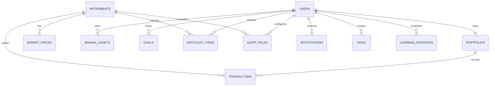

# Thiết kế database MOFI Demo

Phiên bản 1.0. Mô hình này thay cho schema ledger dài hạn trong đợt demo hai ngày. Chưa có migration, bảng hoặc seed thực tế. Kết nối PDO PostgreSQL/TLS đã xác minh, schema public trống vào 17/09/2026.

## 1 Mô hình và quan hệ

12 bảng nghiệp vụ kể cả users. Bảng sessions/cache/jobs/password_reset_tokens của framework là hạ tầng, không phải entity MOFI bổ sung. Mọi id BIGINT identity/PK; cùng kiểu users scaffold. Bảng thường có created_at/updated_at TIMESTAMPTZ; transactions chỉ created_at vì immutable. Trường có `?` được NULL default NULL; các trường khác NOT NULL, không default nếu không ghi. Numeric dùng giới hạn domain trước khi vượt precision.

## 2 Từ điển dữ liệu

### users và portfolios

| Bảng | Cột | Ràng buộc |
| --- | --- | --- |
| users | name VARCHAR(120); email VARCHAR(254); password VARCHAR(255); email_verified_at? TIMESTAMPTZ; remember_token? VARCHAR(100) | Giữ scaffold; unique lower(email), email normalize; password hash; không role/admin UI ở demo |
| portfolios | user_id BIGINT FK users; name VARCHAR(120); currency CHAR(3)='VND' | UNIQUE(user_id), UNIQUE(id,user_id); CHECK currency='VND'; tạo cùng user trong transaction |

Profile dùng name trên users, chưa cần bảng profiles. Một account không thể tự xem portfolio của account khác. Cash không là cột balance chỉnh tay: tính từ sổ transactions. Không có initial_balance trùng deposit.

### instruments và market_prices

| Bảng | Cột | Ràng buộc |
| --- | --- | --- |
| instruments | symbol VARCHAR(32); name VARCHAR(120); market VARCHAR(32); asset_class VARCHAR(24); sector? VARCHAR(80); currency CHAR(3); price_unit VARCHAR(32); tradable BOOLEAN=false | UNIQUE(market,symbol); asset_class stock/index/gold/crypto/other; tradable chỉ VN equity VND trong app validation |
| market_prices | instrument_id BIGINT FK; price_date DATE; close NUMERIC(24,8); reference_close? NUMERIC(24,8); source VARCHAR(32)='demo'; is_demo BOOLEAN=true | UNIQUE(instrument_id,price_date); close>0; reference NULL hoặc>0; source='demo' và is_demo=true; index(instrument_id,price_date DESC) |

Đơn vị thuộc instrument; record không tự mix VND và USD. Mọi giá dựng bằng seed có thể tái lập, không gọi API thật. Source ghi nguồn mô phỏng, không gắn tên sàn như đã lấy dữ liệu thật. latest không sau simulation_date 2026-09-15; không phải latest theo ngày máy tùy ý.

### transactions

| Cột | Kiểu | Quy tắc |
| --- | --- | --- |
| user_id / portfolio_id | BIGINT | Composite FK(portfolio_id,user_id)->portfolios(id,user_id) |
| instrument_id? | BIGINT FK instruments | Required BUY/SELL/DIVIDEND; NULL deposit/withdraw |
| kind | VARCHAR(16) | DEPOSIT/WITHDRAW/BUY/SELL/DIVIDEND |
| trade_date | DATE | Ngày mô phỏng; user write phải >= event trước; UI không cho sửa ngày |
| quantity? | NUMERIC(24,8) | BUY/SELL nguyên >0 cho cổ phiếu VN; loại khác NULL |
| unit_price? | NUMERIC(24,8) | BUY/SELL >0; loại khác NULL |
| gross_amount | NUMERIC(24,0) | >0, BUY/SELL=round_half_up(q*price) |
| fee / tax | NUMERIC(24,0) default 0 | >=0; deposit/withdraw=0; SELL/DIVIDEND gross>=fee+tax |
| cash_delta | NUMERIC(24,0) | Signed, do server tính, không chấp nhận từ client |
| request_key | UUID | UNIQUE(portfolio_id,request_key) |
| request_hash | CHAR(64) | Hash normalized payload, duplicate khác hash trả 409 |
| created_at | TIMESTAMPTZ default now() | Thời điểm ghi thật UTC; thứ tự replay(trade_date,id) |

CHECK row shape theo kind, cash_delta theo công thức: deposit +gross; withdraw -gross; buy -(gross+fee+tax); sell/dividend gross-fee-tax. BUY/SELL check gross bằng round(quantity*unit_price). Mọi fee/tax VND nguyên, input max qty10^9, price10^12, tổngamount<10^20. Không lưu realized/basis độc lập để lệch replay; domain tính lại trên small dataset. Không UPDATE/DELETE transaction qua route, PostgreSQL financial FK delete RESTRICT. Không force unique timestamp vì hai giao dịch cùng ngày hợp lệ.

### manual_assets và goals

| Bảng | Cột | Ràng buộc |
| --- | --- | --- |
| manual_assets | user_id FK; name VARCHAR(120); category VARCHAR(24); current_value NUMERIC(24,0); valued_on DATE | category gold/property/other; current_value>=0; chỉ current valuation, không chart lịch sử wealth thủ công |
| goals | user_id FK; name VARCHAR(120); category VARCHAR(24); target_amount NUMERIC(24,0); saved_amount NUMERIC(24,0) default 0; target_date? DATE | target>0,saved>=0; category home/education/emergency/car/retirement/other; saved không linked cash, không cộng wealth |

Manual asset sửa/xóa chỉ ảnh hưởng tổng hiện tại; chart danh mục chỉ C+S, không hứa lịch sử total wealth. Mục tiêu là sổ tiến độ đơn giản, không goal allocation/earmark và không chặn spendable cash.

### watchlist_items alert_rules notifications tasks learning_progress

| Bảng | Cột | Ràng buộc |
| --- | --- | --- |
| watchlist_items | user_id FK; instrument_id FK | UNIQUE(user_id,instrument_id); một watchlist/user |
| alert_rules | user_id FK; instrument_id FK; operator VARCHAR(3); threshold NUMERIC(24,8); enabled BOOLEAN=true; last_condition? BOOLEAN; last_checked_at? TIMESTAMPTZ | operator GTE/LTE,threshold>0; giá so cùng đơn vị; lock rule khi evaluate |
| notifications | user_id FK; title VARCHAR(240); body TEXT; source_rule_id? BIGINT; observed_price? NUMERIC(24,8); source_date? DATE; read_at? TIMESTAMPTZ | source_rule_id là ID audit tùy chọn, không FK sau xóa rule; server ghi owner từ rule; title/body snapshot không chứa secrets |
| tasks | user_id FK; title VARCHAR(240); due_date? DATE; completed_at? TIMESTAMPTZ | title không rỗng; index(user_id,due_date) |
| learning_progress | user_id FK; lesson_slug VARCHAR(80); completed_at TIMESTAMPTZ | UNIQUE(user_id,lesson_slug); lesson slug allowlist từ content JSON versioned |

Mỗi bảng user-owned index user_id; notifications thêm(user_id,read_at,created_at). Xóa user không có endpoint demo; tài chính FK RESTRICT. Không dùng JSON tùy ý để làm nơi chứa tất cả các nghiệp vụ. Nội dung khóa/bài/chiến lược/community là fixture versioned, không CMS, không bảng thuê bao/chat trong demo.

## 3 Tính toán và chống trùng

Cash=sum cash_delta. Replay BUY/SELL theo trade_date,id: BUY Q+=q,B+=gross+fee+tax; SELL sold_basis=round8(B*q/Q), bán hết lấy hếtB, R+=gross-fee-tax-sold_basis,Q-=q,B-=sold_basis. Income I=sum net dividend. S=sumQ*latest_quote; U=S-B; P/L=R+U+I; portfolio V=Cash+S; total assets W=V+sum manual_assets. Goal không cộng vàoW. Tỷ lệ U/B chỉ hiển thị khiB>0, không gọi là tỷ suất toàn bộ danh mục.

Để ghi giao dịch: owner policy -> transaction DB -> khóa portfolio FOR UPDATE -> kiểm tra request_key/hash -> replay hiện tại -> validate cash/quantity/date -> insert -> commit. Concurrent sell không cùng đọc số dư cũ. Payload key khác không được replay receipt khác. Biểu đồ historical portfolio EOD dùng giao dịch đến từng ngày và giá<=ngày đó; sau event mới tính lại điểm ngày mô phỏng. Dataset demo nhỏ nên chưa cần projections/snapshots/queues, nhưng giới hạn input/list pagination rõ ràng.

Thiếu quote: S và W không đầy đủ, trả NULL + known_value và label, không giá 0. Không có intraday nên bỏ nút 1D hoặc disabled có chú thích. Tất cả decimals response dạng chuỗi.

## 4 Bộ dữ liệu và kiểm chứng

Seed riêng hai users A/B, mỗi người portfolio riêng. Password demo đặt local `DEMO_LOGIN_PASSWORD` khi viết seeder, hash trước lưu, không trùng DB password, không in secret trong CI. Seed A có price history 30 ngày kết thúc 15/09/2026; ngày thật created_at không thay simulation date. Seed B rỗng để test ownership. Catalog có mã VN, index, vàng và crypto với nguồn demo.

Fixture tiền của A: deposit 30.000.000; buy 100 @100.000 fee 10.000; buy 100 @120.000 fee 10.000; sell 50 @130.000 fee 10.000; dividend 100.000 tax 5.000. Thuế trade giả định 0. Quote cuối 125.000, manual asset 5.000.000, goal target 10.000.000 saved 2.000.000.

| Giá trị | Expected VND |
| --- | ---: |
| Cash | 14.565.000 |
| Quantity còn | 150 cổ phiếu |
| Remaining basis | 16.515.000 |
| Securities value | 18.750.000 |
| Realized P/L | 985.000 |
| Unrealized P/L | 2.235.000 |
| Net income | 95.000 |
| Total investment P/L | 3.315.000 |
| Portfolio value cash và securities | 33.315.000 |
| Total assets có manual | 38.315.000 |
| Goal progress | 20% |

Deposit thêm 10m: cash 24.565.000, wealth 48.315.000, P/L vẫn3.315.000. Mua thêm 10@125.000 fee 0 sau fixture gốc: cash13.315.000,Q = 160,B17.765.000,S20.000.000,W = 38.315.000. Bán hết lấy hếtbasis, không residue. Simulation giảm 20% giá từ fixture gốc: S15.000.000,W34.565.000, lỗ kịch bản3.750.000, DB không đổi.

## 5 Migrations và Supabase

Thứ tự: users/framework -> portfolios -> instruments/market_prices -> transactions -> manual_assets/goals -> watchlist/alerts/notifications/tasks/progress. Không chạy migrations trước khi bắt đầu đợt code theo yêu cầu hiện tại. Kiểm tra DB thông qua Laravel sau setup; dùng database test riêng cho migrate:fresh. Seed thêm account demo idempotent, không reset Supabase dùng chung.

Backend kết nối direct PostgreSQL TLS; verify routing bằng Laravel và xem grants/Data API trước khi tạo bảng. Vì browser không dùng Supabase API, không cấp anon/authenticated quyền đọc bảng tài chính. Nếu bảng đặt public thì cần revoke grants phù hợp hoặc disable Data API; kiểm chứng bằng request không auth không đọc được dữ liệu. Chưa tự đánh dấu phần này đã làm. Không cần đổi password tài khoản Supabase để hoàn thành tài liệu.
